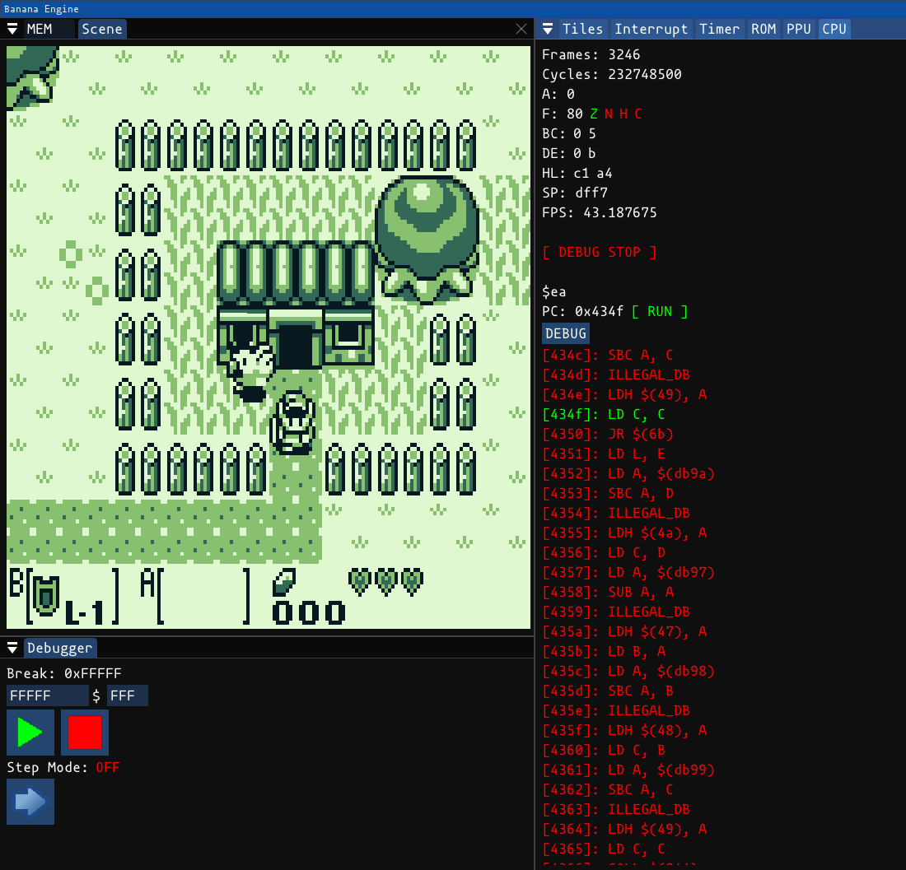

# GameBoy Color Emulator

This emulator features the most basic things, like playing TLOZ or Kirby's Dream Land 2 with save games and basic mbc1 functionality implemented.

As always, this project is also WIP.

</a>
# Resources:
<a href="https://en.wikipedia.org/wiki/Game_Boy_Color">Wikipedia</a>
<a href="https://gbdev.io/pandocs/Specifications.html">Reference</a>

A huge thanks for all the support in the Emulation Development Discord!

# To-Do
- [X] Fix sprite bugs
- [X] Fix slowness
- [X] MBC1 Support
- [ ] MBC3 Support 
- [ ] APU
- [ ] Cycle accurate emulation (currently runs at fullspeed)

- [ ] G a m e B o y C o l o r
- [ ] port to android

## Passing tests
- [X] 01-special
- [X] 02-interrupts
- [X] 03-op sp,hl
- [X] 04-ld r,imm
- [X] 05-op rp
- [X] 06-ld r,r
- [X] 07-jr,jp,call,ret,rst
- [X] 08-misc instrs
- [X] 09-op r,r
- [X] 10-bit ops
- [X] 11-op a,(hl)

- [X] dmg-acid2 (this was hell)
 
# Instructions

Generate build files:

## Windows:

```run.bat```

Then open the Visual Studio Solution and compile the "Sandbox" Project.

## Linux:

premake5 should be installed on the system

```premake5 gmake2```

```make```

```./run.sh```

# Info
This is Linux and Windows compatible. All dependencies are within this repository.

# Motivation
For me, playing games is not enough. I rather prefer to emulate the game's console to fullfill my insanity.
